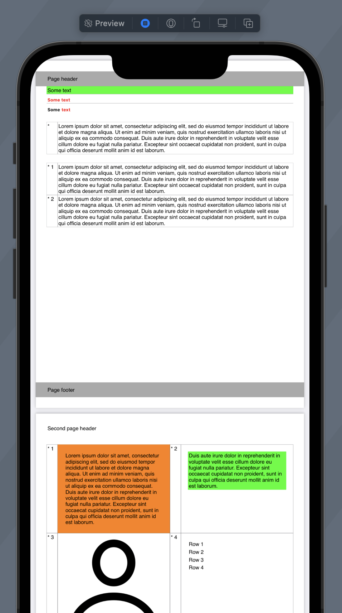

# PdfBuilder

PdfBuilder is a swift library made to make creation of the Pdf file from code simpler. It's inspired by SwiftUI and give similar declarative interface to design page layout.

## Layout components
    -Background
    -ClipShape
    -Divider
    -Grid
    -Image
    -Padding
    -PageBackground
    -PageBreak
    -PageCounter
    -PageHeader
    -Spacer
    -Text
    -VStack

## StringAttributes
 Alias for NSAttributedString.Key dictionary allows union multiple dictionaries in a shorter way
 ```
 StringAttributes.caption().foregroundColor(.red)
 ```

 ## Sample

<table>
<tr>
     <td width="50%">Code</td>
     <td width="50%">Pdf preview</td>
</tr>
<tr>
<td valign="top" width="50%">

    let builder = Pdf.Builder()

    builder.items = [
        Pdf.PageHeader(top: [
            Pdf.Spacer( 8),
            Pdf.Text("Page header"),
            Pdf.Spacer( 8),
        ], bottom: [
            Pdf.Spacer( 8),
            Pdf.Text("Page footer"),
            Pdf.Spacer( 8),
        ], backgroundColorFill: .lightGray),

        Pdf.Background(color: .green, Pdf.Text("Some text")),
        Pdf.Divider(),

        Pdf.Text("Some text", attributes: .boldRed()),
        Pdf.Divider(),

        Pdf.Text([
            NSAttributedString(
                string: "Some",
                attributes: .bold()),
            NSAttributedString(
                string: "text",
                attributes: .boldRed())
        ].joined(with: " ")),

        Pdf.Spacer(20),

        Pdf.Grid(columns: [.fixed(v: 25), .flexible], items: [
            Pdf.Text("*"),
            Pdf.Text(lorem)
        ]),

        Pdf.Spacer(20),

        Pdf.Grid(columns: [.fixed(v: 25), .flexible], items: [
            Pdf.Text("* 1"),
            Pdf.Text(lorem),
            Pdf.Text("* 2"),
            Pdf.Text(lorem)
        ]),

        Pdf.PageHeader(top: [
            Pdf.Text("Second page header"),
            Pdf.Spacer( 8),
        ]),

        Pdf.Spacer(20),

        Pdf.Grid(
            columns: [
                .fixed(v: 25), .flexible,
                .fixed(v: 25), .flexible],
            items: [
                
                Pdf.Text("* 1"),
                Pdf.Text(lorem)
                    .padding(16)
                    .background(.orange),
                
                Pdf.Text("* 2"),
                Pdf.Padding(
                    size: 16, Pdf.Background(
                        color: .green, Pdf.Text(lorem2))),
                
                Pdf.Text("* 3"),
                Pdf.Image(UIImage(systemName: "person")),
                Pdf.Text("* 4"),
                Pdf.VStack([
                    Pdf.Text("Row 1"),
                    Pdf.Text("Row 2"),
                    Pdf.Text("Row 3"),
                    Pdf.Text("Row 4")
                ]).padding(16)
        ])
    ]

    let data = builder.generateNewPdf() as Data

</td>
<td valign="top" width="50%"></td>
</tr>
</table>
